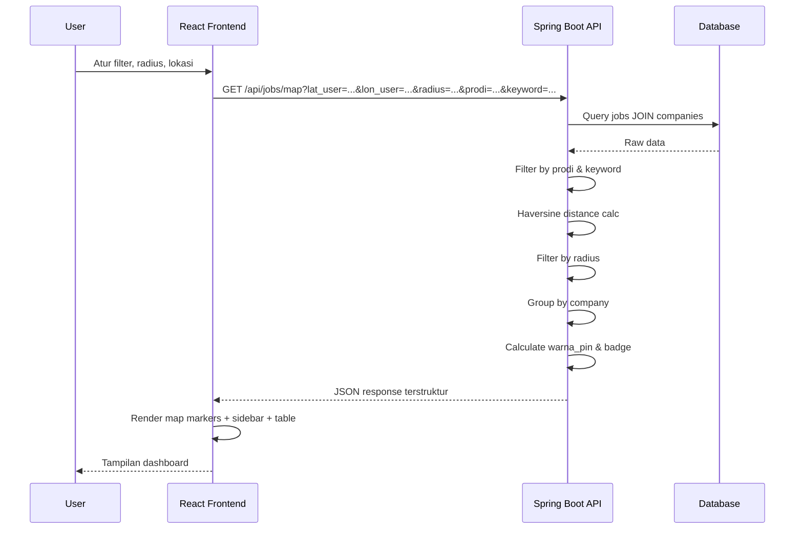

# GeoJob Hunter — Aplikasi Web Pencari Lowongan Kerja Berbasis Peta Interaktif

> **Stack:** React (Vite) + Tailwind CSS + Leaflet | Spring Boot (Java) | MySQL/PostgreSQL | Python

---

## Alur Sistem (End-to-End Flow)

```mermaid
flowchart TD
    A[Python Scraper<br/>(Tahap 2)] -->|Mock Data + Geocoding| B[(Database<br/>MySQL/PostgreSQL)]
    B -->|Entity JPA| C[Spring Boot API<br/>(Tahap 1 + 3)]
    C -->|GET /api/jobs/map| D[React Frontend<br/>(Tahap 4)]
    D -->|Filter + Slider + GPS| C
    
    subgraph Backend Logic
        C --> E[Haversine Filter]
        C --> F[Prodi & Keyword Filter]
        C --> G[Group By Company]
        C --> H[Warna Pin Dinamis]
        C --> I[Smart Advisory Badge]
    end
    
    D --> J[Leaflet Map]
    D --> K[Sidebar Kontrol]
    D --> L[Tabel Lowongan]
    J -->|Popup| M[Info Perusahaan + Tombol Rute]
    K -->|Input User| C
```

### Alur Data (Request → Response)



---

## Arsitektur Sistem

```
┌─────────────────────────────────────────────────────┐
│                   Frontend (React + Vite)            │
│  ┌──────────────┐  ┌──────────────────────────────┐ │
│  │  Sidebar      │  │        Main Panel            │ │
│  │  - Input GPS  │  │  ┌────────────────────────┐ │ │
│  │  - Slider     │  │  │   Metrics Cards         │ │ │
│  │  - Dropdown   │  │  ├────────────────────────┤ │ │
│  │  - Cari       │  │  │   Leaflet Map           │ │ │
│  │  - Urutkan    │  │  ├────────────────────────┤ │ │
│  └──────────────┘  │  │   Tabel Lowongan        │ │ │
│                     │  └────────────────────────┘ │ │
│                     └──────────────────────────────┘ │
└──────────────────────┬──────────────────────────────┘
                       │ HTTP (Axios/Fetch)
┌──────────────────────▼──────────────────────────────┐
│           Backend API (Spring Boot)                  │
│  ┌────────────┐  ┌──────────┐  ┌──────────────────┐ │
│  │ Controller  │→│ Service  │→│   Repository      │ │
│  │ /api/jobs/* │  │ Haversine│  │   (JPA/Hibernate)│ │
│  │             │  │ Filter   │  │                  │ │
│  │             │  │ Grouping │  │  CompanyRepo     │ │
│  │             │  │ Badge    │  │  JobRepo         │ │
│  └────────────┘  └──────────┘  └────────┬─────────┘ │
└──────────────────────────────────────────┬───────────┘
                                           │
┌──────────────────────────────────────────▼───────────┐
│              Database (MySQL/PostgreSQL)              │
│  ┌───────────────────┐    ┌──────────────────────┐   │
│  │    company        │    │      job              │   │
│  │───────────────────│    │──────────────────────│   │
│  │ id (PK)           │←───│ company_id (FK)      │   │
│  │ nama_perusahaan   │    │ nama_lowongan        │   │
│  │ alamat            │    │ prodi_syarat         │   │
│  │ lat               │    │ kuota                │   │
│  │ lon               │    │ link_lamar           │   │
│  └───────────────────┘    └──────────────────────┘   │
└──────────────────────────────────────────────────────┘
                           ▲
┌──────────────────────────┴──────────────────────────┐
│        Python Scraper (Data Seeder)                  │
│  ┌────────────┐  ┌──────────┐  ┌──────────────────┐ │
│  │ Mock Data   │→│ Geocoding │→│ Upsert to DB     │ │
│  │ 10+ records │  │ Nominatim│  │ (psycopg2/mysql)│ │
│  └────────────┘  └──────────┘  └──────────────────┘ │
└──────────────────────────────────────────────────────┘
```

---

# Spesifikasi Lengkap per Tahap

---

## TAHAP 0: Prasyarat & Konfigurasi Lingkungan

### Build Tool & Versi

| Komponen | Teknologi | Versi |
|----------|-----------|-------|
| Backend | Java + Spring Boot | Java 17+, Spring Boot 3.x |
| Build Tool | Maven (pom.xml) | 3.8+ |
| Database | MySQL 8+ / PostgreSQL 14+ | - |
| Frontend | React + Vite | React 18, Vite 5 |
| CSS | Tailwind CSS | 3.x |
| Map | React-Leaflet | 4.x |
| Scraper | Python | 3.10+ |

### Struktur Direktori Project

```
GeoJobHunter/
├── backend/
│   ├── pom.xml
│   ├── src/main/java/com/geojob/
│   │   ├── GeoJobApplication.java
│   │   ├── config/
│   │   │   └── CorsConfig.java
│   │   ├── entity/
│   │   │   ├── Company.java
│   │   │   └── Job.java
│   │   ├── repository/
│   │   │   ├── CompanyRepository.java
│   │   │   └── JobRepository.java
│   │   ├── service/
│   │   │   └── JobMapService.java
│   │   ├── controller/
│   │   │   └── JobMapController.java
│   │   └── dto/
│   │       ├── CompanyJobDTO.java
│   │       ├── JobDTO.java
│   │       └── MapResponseDTO.java
│   └── src/main/resources/
│       └── application.yml
├── frontend/
│   ├── package.json
│   ├── vite.config.js
│   ├── tailwind.config.js
│   ├── index.html
│   ├── src/
│   │   ├── App.jsx
│   │   ├── main.jsx
│   │   ├── components/
│   │   │   ├── Sidebar.jsx
│   │   │   ├── MetricsCards.jsx
│   │   │   ├── JobMap.jsx
│   │   │   ├── JobTable.jsx
│   │   │   └── MapPopup.jsx
│   │   ├── hooks/
│   │   │   └── useJobMap.js
│   │   └── services/
│   │       └── api.js
│   └── .env
├── scraper/
│   ├── requirements.txt
│   └── seed_data.py
└── database/
    └── schema.sql
```

### application.yml

```yaml
server:
  port: 8080

spring:
  datasource:
    url: jdbc:mysql://localhost:3306/geojob_hunter?useSSL=false&allowPublicKeyRetrieval=true&serverTimezone=Asia/Jakarta
    username: root
    password: ${DB_PASSWORD:root}
    driver-class-name: com.mysql.cj.jdbc.Driver
  jpa:
    hibernate:
      ddl-auto: update
    show-sql: true
    properties:
      hibernate:
        dialect: org.hibernate.dialect.MySQLDialect

# Untuk PostgreSQL, gunakan konfigurasi di bawah:
# spring:
#   datasource:
#     url: jdbc:postgresql://localhost:5432/geojob_hunter
#     username: postgres
#     password: ${DB_PASSWORD:postgres}
#   jpa:
#     properties:
#       hibernate:
#         dialect: org.hibernate.dialect.PostgreSQLDialect
```

### .env (Frontend)

```env
VITE_API_BASE_URL=http://localhost:8080
VITE_MAP_DEFAULT_LAT=-6.2000
VITE_MAP_DEFAULT_LON=106.8166
VITE_MAP_DEFAULT_ZOOM=12
```

### CORS Config (Spring Boot)

```java
package com.geojob.config;

import org.springframework.context.annotation.Bean;
import org.springframework.context.annotation.Configuration;
import org.springframework.web.servlet.config.annotation.CorsRegistry;
import org.springframework.web.servlet.config.annotation.WebMvcConfigurer;

@Configuration
public class CorsConfig {

    @Bean
    public WebMvcConfigurer corsConfigurer() {
        return new WebMvcConfigurer() {
            @Override
            public void addCorsMappings(CorsRegistry registry) {
                registry.addMapping("/api/**")
                        .allowedOrigins("http://localhost:5173")
                        .allowedMethods("GET", "POST", "PUT", "DELETE", "OPTIONS")
                        .allowedHeaders("*");
            }
        };
    }
}
```

---

## TAHAP 1: Database Schema & Spring Boot Entities

### Script DDL SQL (`database/schema.sql`)

```sql
CREATE DATABASE IF NOT EXISTS geojob_hunter;
USE geojob_hunter;

CREATE TABLE company (
    id BIGINT AUTO_INCREMENT PRIMARY KEY,
    nama_perusahaan VARCHAR(255) NOT NULL,
    alamat TEXT,
    lat DOUBLE NOT NULL,
    lon DOUBLE NOT NULL
);

CREATE TABLE job (
    id BIGINT AUTO_INCREMENT PRIMARY KEY,
    company_id BIGINT NOT NULL,
    nama_lowongan VARCHAR(255) NOT NULL,
    prodi_syarat TEXT,
    kuota INT DEFAULT 1,
    link_lamar VARCHAR(500),
    FOREIGN KEY (company_id) REFERENCES company(id) ON DELETE CASCADE
);

CREATE INDEX idx_job_company ON job(company_id);
CREATE INDEX idx_company_coord ON company(lat, lon);
CREATE INDEX idx_job_prodi ON job(prodi_syarat(100));
```

### Entity Company (`Company.java`)

```java
package com.geojob.entity;

import com.fasterxml.jackson.annotation.JsonManagedReference;
import jakarta.persistence.*;
import java.util.ArrayList;
import java.util.List;

@Entity
@Table(name = "company")
public class Company {

    @Id
    @GeneratedValue(strategy = GenerationType.IDENTITY)
    private Long id;

    @Column(name = "nama_perusahaan", nullable = false)
    private String namaPerusahaan;

    @Column(columnDefinition = "TEXT")
    private String alamat;

    @Column(nullable = false)
    private Double lat;

    @Column(nullable = false)
    private Double lon;

    @OneToMany(mappedBy = "company", cascade = CascadeType.ALL, fetch = FetchType.LAZY)
    @JsonManagedReference
    private List<Job> jobs = new ArrayList<>();

    // Constructors
    public Company() {}

    public Company(String namaPerusahaan, String alamat, Double lat, Double lon) {
        this.namaPerusahaan = namaPerusahaan;
        this.alamat = alamat;
        this.lat = lat;
        this.lon = lon;
    }

    // Getters and Setters
    public Long getId() { return id; }
    public void setId(Long id) { this.id = id; }

    public String getNamaPerusahaan() { return namaPerusahaan; }
    public void setNamaPerusahaan(String namaPerusahaan) { this.namaPerusahaan = namaPerusahaan; }

    public String getAlamat() { return alamat; }
    public void setAlamat(String alamat) { this.alamat = alamat; }

    public Double getLat() { return lat; }
    public void setLat(Double lat) { this.lat = lat; }

    public Double getLon() { return lon; }
    public void setLon(Double lon) { this.lon = lon; }

    public List<Job> getJobs() { return jobs; }
    public void setJobs(List<Job> jobs) { this.jobs = jobs; }
}
```

### Entity Job (`Job.java`)

```java
package com.geojob.entity;

import com.fasterxml.jackson.annotation.JsonBackReference;
import jakarta.persistence.*;

@Entity
@Table(name = "job")
public class Job {

    @Id
    @GeneratedValue(strategy = GenerationType.IDENTITY)
    private Long id;

    @ManyToOne(fetch = FetchType.LAZY)
    @JoinColumn(name = "company_id", nullable = false)
    @JsonBackReference
    private Company company;

    @Column(name = "nama_lowongan", nullable = false)
    private String namaLowongan;

    @Column(name = "prodi_syarat", columnDefinition = "TEXT")
    private String prodiSyarat;

    @Column(nullable = false)
    private Integer kuota = 1;

    @Column(name = "link_lamar", length = 500)
    private String linkLamar;

    // Constructors
    public Job() {}

    public Job(String namaLowongan, String prodiSyarat, Integer kuota, String linkLamar) {
        this.namaLowongan = namaLowongan;
        this.prodiSyarat = prodiSyarat;
        this.kuota = kuota;
        this.linkLamar = linkLamar;
    }

    // Getters and Setters
    public Long getId() { return id; }
    public void setId(Long id) { this.id = id; }

    public Company getCompany() { return company; }
    public void setCompany(Company company) { this.company = company; }

    public String getNamaLowongan() { return namaLowongan; }
    public void setNamaLowongan(String namaLowongan) { this.namaLowongan = namaLowongan; }

    public String getProdiSyarat() { return prodiSyarat; }
    public void setProdiSyarat(String prodiSyarat) { this.prodiSyarat = prodiSyarat; }

    public Integer getKuota() { return kuota; }
    public void setKuota(Integer kuota) { this.kuota = kuota; }

    public String getLinkLamar() { return linkLamar; }
    public void setLinkLamar(String linkLamar) { this.linkLamar = linkLamar; }
}
```

### Penjelasan `@JsonManagedReference` / `@JsonBackReference`

- **`@JsonManagedReference`** di sisi `Company` (parent): serialisasi normal.
- **`@JsonBackReference`** di sisi `Job` (child): skip serialisasi balik ke parent.
- Ini mencegah **infinite loop recursion** saat Jackson mengubah entity ke JSON.

---

## TAHAP 2: Python Scraper & Geocoder Script

### Library & Instalasi (`scraper/requirements.txt`)

```
geopy==2.4.1
mysql-connector-python==8.3.0
# Untuk PostgreSQL, ganti dengan:
# psycopg2-binary==2.9.9
python-dotenv==1.0.1
```

Instalasi:

```bash
cd scraper
pip install -r requirements.txt
```

### Script Python (`scraper/seed_data.py`)

```python
"""
GeoJob Hunter - Data Seeder
Script untuk mengisi database dengan mock data + geocoding.
"""

import time
import mysql.connector
from geopy.geocoders import Nominatim
from dotenv import load_dotenv
import os

load_dotenv()

# ======================= KONFIGURASI DATABASE =======================
DB_CONFIG = {
    "host": os.getenv("DB_HOST", "localhost"),
    "user": os.getenv("DB_USER", "root"),
    "password": os.getenv("DB_PASSWORD", ""),
    "database": os.getenv("DB_NAME", "geojob_hunter"),
}

# ======================= MOCK DATA (10+ records) =======================
# Beberapa perusahaan punya >1 lowongan untuk menguji Many-to-One
MOCK_DATA = [
    {
        "nama_perusahaan": "PT Teknologi Nusantara",
        "alamat": "Jalan M.H. Thamrin No. 10, Jakarta Pusat",
        "lowongan": [
            {"nama": "Fullstack Developer", "prodi": ["Informatika", "Sistem Informasi"], "kuota": 5, "link": "https://career.teknonusantara.com/fullstack"},
            {"nama": "Backend Engineer", "prodi": ["Informatika"], "kuota": 3, "link": "https://career.teknonusantara.com/backend"},
            {"nama": "UI/UX Designer", "prodi": ["DKV", "Sistem Informasi"], "kuota": 2, "link": "https://career.teknonusantara.com/uiux"},
        ]
    },
    {
        "nama_perusahaan": "PT Bank Digital Indo",
        "alamat": "Jalan Jenderal Sudirman Kav 52-53, Jakarta Selatan",
        "lowongan": [
            {"nama": "Mobile Developer", "prodi": ["Informatika", "Sistem Informasi"], "kuota": 4, "link": "https://career.bankdigital.com/mobile"},
            {"nama": "Data Analyst", "prodi": ["Informatika", "Sistem Informasi", "Akuntansi"], "kuota": 6, "link": "https://career.bankdigital.com/da"},
        ]
    },
    {
        "nama_perusahaan": "PT E-Commerce Maju",
        "alamat": "Jalan Gatot Subroto No. 38, Jakarta Selatan",
        "lowongan": [
            {"nama": "Software Engineer", "prodi": ["Informatika", "Sistem Informasi", "Ilmu Komputer"], "kuota": 8, "link": "https://career.ecmaju.com/se"},
        ]
    },
    {
        "nama_perusahaan": "PT Media Kreatif Digital",
        "alamat": "Jalan Asia Afrika No. 8, Bandung",
        "lowongan": [
            {"nama": "Graphic Designer", "prodi": ["DKV"], "kuota": 2, "link": "https://career.mediakreatif.com/gd"},
            {"nama": "Content Writer", "prodi": ["Ilmu Komunikasi", "DKV"], "kuota": 3, "link": "https://career.mediakreatif.com/cw"},
            {"nama": "Social Media Specialist", "prodi": ["Ilmu Komunikasi"], "kuota": 4, "link": "https://career.mediakreatif.com/sms"},
        ]
    },
    {
        "nama_perusahaan": "PT Solusi Fintech Indonesia",
        "alamat": "Jalan Kemang Raya No. 12, Jakarta Selatan",
        "lowongan": [
            {"nama": "Flutter Developer", "prodi": ["Informatika", "Sistem Informasi"], "kuota": 3, "link": "https://career.solusi-fintech.com/flutter"},
            {"nama": "Product Manager", "prodi": ["Sistem Informasi", "Ilmu Komunikasi", "Akuntansi"], "kuota": 1, "link": "https://career.solusi-fintech.com/pm"},
        ]
    },
    {
        "nama_perusahaan": "PT Rumah Sakit Sehat",
        "alamat": "Jalan Diponegoro No. 50, Surabaya",
        "lowongan": [
            {"nama": "IT Support", "prodi": ["Informatika", "Sistem Informasi"], "kuota": 2, "link": "https://career.rssehat.com/it"},
        ]
    },
    {
        "nama_perusahaan": "PT Konsultan Bisnis Global",
        "alamat": "Jalan Thamrin Boulevard No. 99, Jakarta Pusat",
        "lowongan": [
            {"nama": "Junior Auditor", "prodi": ["Akuntansi"], "kuota": 5, "link": "https://career.kbg.co.id/auditor"},
            {"nama": "Tax Consultant", "prodi": ["Akuntansi"], "kuota": 3, "link": "https://career.kbg.co.id/tax"},
            {"nama": "Business Analyst", "prodi": ["Sistem Informasi", "Akuntansi"], "kuota": 2, "link": "https://career.kbg.co.id/ba"},
        ]
    },
    {
        "nama_perusahaan": "PT Startup AI Indonesia",
        "alamat": "Jalan Cisangkuy No. 15, Bandung",
        "lowongan": [
            {"nama": "AI Engineer", "prodi": ["Informatika"], "kuota": 2, "link": "https://career.startupai.com/ai"},
            {"nama": "Data Scientist", "prodi": ["Informatika", "Sistem Informasi"], "kuota": 4, "link": "https://career.startupai.com/ds"},
        ]
    },
    {
        "nama_perusahaan": "PT Edukasi Digital Nusantara",
        "alamat": "Jalan Pahlawan No. 20, Semarang",
        "lowongan": [
            {"nama": "Frontend Developer", "prodi": ["Informatika", "Sistem Informasi"], "kuota": 3, "link": "https://career.edunusa.com/frontend"},
            {"nama": "Instructional Designer", "prodi": ["Ilmu Komunikasi", "DKV"], "kuota": 2, "link": "https://career.edunusa.com/id"},
        ]
    },
    {
        "nama_perusahaan": "PT Teknologi Nusantara",  # Sama dengan data pertama -> uji Many-to-One
        "alamat": "Jalan M.H. Thamrin No. 10, Jakarta Pusat",
        "lowongan": [
            {"nama": "DevOps Engineer", "prodi": ["Informatika", "Sistem Informasi"], "kuota": 2, "link": "https://career.teknonusantara.com/devops"},
        ]
    },
]

# ======================= KOORDINAT FALLBACK =======================
FALLBACK_LAT = -6.2000
FALLBACK_LON = 106.8166

# ======================= FUNGSI GEOCODING =======================
def geocode_address(alamat: str) -> tuple:
    """
    Mengubah alamat jadi (lat, lon) pakai Nominatim.
    Fallback ke koordinat Jakarta pusat jika gagal.
    """
    try:
        geolocator = Nominatim(user_agent="geojob_hunter_seeder")
        location = geolocator.geocode(alamat, timeout=10)
        if location:
            return (location.latitude, location.longitude)
        else:
            print(f"  ⚠ Geocode gagal untuk: {alamat[:50]}... Pakai fallback Jakarta")
            return (FALLBACK_LAT, FALLBACK_LON)
    except Exception as e:
        print(f"  ⚠ Error geocode: {e}. Pakai fallback Jakarta")
        return (FALLBACK_LAT, FALLBACK_LON)


# ======================= FUNGSI UPSERT KE DATABASE =======================
def upsert_company(cursor, nama: str, alamat: str, lat: float, lon: float) -> int:
    """
    Cek apakah perusahaan dengan nama & alamat yang sama sudah ada.
    Jika ada, return id-nya. Jika tidak, insert baru.
    """
    query_check = "SELECT id FROM company WHERE nama_perusahaan = %s AND alamat = %s"
    cursor.execute(query_check, (nama, alamat))
    existing = cursor.fetchone()

    if existing:
        print(f"  ↻ Perusahaan sudah ada: {nama} (ID: {existing[0]})")
        return existing[0]

    query_insert = "INSERT INTO company (nama_perusahaan, alamat, lat, lon) VALUES (%s, %s, %s, %s)"
    cursor.execute(query_insert, (nama, alamat, lat, lon))
    new_id = cursor.lastrowid
    print(f"  + Perusahaan baru: {nama} (ID: {new_id})")
    return new_id


def insert_job(cursor, company_id: int, nama_lowongan: str, prodi_list: list, kuota: int, link: str):
    """Insert lowongan ke tabel job."""
    prodi_str = ", ".join(prodi_list)  # Convert list → comma-separated string
    query = """
        INSERT INTO job (company_id, nama_lowongan, prodi_syarat, kuota, link_lamar)
        VALUES (%s, %s, %s, %s, %s)
    """
    cursor.execute(query, (company_id, nama_lowongan, prodi_str, kuota, link))
    print(f"    → Lowongan: {nama_lowongan} (Kuota: {kuota})")


# ======================= MAIN =======================
def main():
    print("=" * 60)
    print("GeoJob Hunter - Data Seeder")
    print("=" * 60)

    # Koneksi ke database
    conn = mysql.connector.connect(**DB_CONFIG)
    cursor = conn.cursor()
    print(f"\n✓ Terkoneksi ke database: {DB_CONFIG['database']}\n")

    total_jobs = 0

    for i, item in enumerate(MOCK_DATA, 1):
        print(f"[{i}/{len(MOCK_DATA)}] {item['nama_perusahaan']}")
        print(f"    Alamat: {item['alamat']}")

        # Geocoding
        lat, lon = geocode_address(item["alamat"])
        print(f"    Koordinat: {lat:.4f}, {lon:.4f}")
        time.sleep(1)  # Rate limit Nominatim

        # Upsert company
        company_id = upsert_company(cursor, item["nama_perusahaan"], item["alamat"], lat, lon)

        # Insert jobs
        for lowongan in item["lowongan"]:
            insert_job(cursor, company_id, lowongan["nama"], lowongan["prodi"], lowongan["kuota"], lowongan["link"])
            total_jobs += 1
            conn.commit()

        print()

    print(f"\n✓ Selesai! Total {total_jobs} lowongan dari {len(MOCK_DATA)} perusahaan telah di-seed.")

    cursor.close()
    conn.close()


if __name__ == "__main__":
    main()
```

### Cara Menjalankan

```bash
cd scraper
cp .env.example .env   # isi kredensial DB
python seed_data.py
```

---

## TAHAP 3: Spring Boot REST API & Spatial Engine

### Repository (`CompanyRepository.java`)

```java
package com.geojob.repository;

import com.geojob.entity.Company;
import org.springframework.data.jpa.repository.JpaRepository;
import org.springframework.stereotype.Repository;
import java.util.Optional;

@Repository
public interface CompanyRepository extends JpaRepository<Company, Long> {
    Optional<Company> findByNamaPerusahaanAndAlamat(String namaPerusahaan, String alamat);
}
```

### Repository (`JobRepository.java`)

```java
package com.geojob.repository;

import com.geojob.entity.Job;
import org.springframework.data.jpa.repository.JpaRepository;
import org.springframework.data.jpa.repository.Query;
import org.springframework.data.repository.query.Param;
import org.springframework.stereotype.Repository;
import java.util.List;

@Repository
public interface JobRepository extends JpaRepository<Job, Long> {

    @Query("SELECT j FROM Job j JOIN FETCH j.company WHERE " +
           "(:prodi IS NULL OR LOWER(j.prodiSyarat) LIKE LOWER(CONCAT('%', :prodi, '%'))) AND " +
           "(:keyword IS NULL OR LOWER(j.namaLowongan) LIKE LOWER(CONCAT('%', :keyword, '%')))")
    List<Job> findFilteredJobs(@Param("prodi") String prodi,
                               @Param("keyword") String keyword);
}
```

### DTO Classes

```java
// JobDTO.java
package com.geojob.dto;

public class JobDTO {
    private Long id;
    private String namaLowongan;
    private String prodiSyarat;
    private Integer kuota;
    private String linkLamar;
    private String badge;
    private String tips;

    // Constructor, getters, setters
    public JobDTO() {}

    public JobDTO(Long id, String namaLowongan, String prodiSyarat, Integer kuota, String linkLamar) {
        this.id = id;
        this.namaLowongan = namaLowongan;
        this.prodiSyarat = prodiSyarat;
        this.kuota = kuota;
        this.linkLamar = linkLamar;
    }

    // Getters & Setters...
    public Long getId() { return id; }
    public void setId(Long id) { this.id = id; }
    public String getNamaLowongan() { return namaLowongan; }
    public void setNamaLowongan(String namaLowongan) { this.namaLowongan = namaLowongan; }
    public String getProdiSyarat() { return prodiSyarat; }
    public void setProdiSyarat(String prodiSyarat) { this.prodiSyarat = prodiSyarat; }
    public Integer getKuota() { return kuota; }
    public void setKuota(Integer kuota) { this.kuota = kuota; }
    public String getLinkLamar() { return linkLamar; }
    public void setLinkLamar(String linkLamar) { this.linkLamar = linkLamar; }
    public String getBadge() { return badge; }
    public void setBadge(String badge) { this.badge = badge; }
    public String getTips() { return tips; }
    public void setTips(String tips) { this.tips = tips; }
}

// CompanyJobDTO.java
package com.geojob.dto;

import java.util.List;

public class CompanyJobDTO {
    private Long companyId;
    private String namaPerusahaan;
    private String alamat;
    private Double lat;
    private Double lon;
    private Integer totalKuota;
    private String warnaPin;
    private Double jarakKm;
    private List<JobDTO> lowongan;

    // Constructor, getters, setters...
    public CompanyJobDTO() {}

    public CompanyJobDTO(Long companyId, String namaPerusahaan, String alamat, Double lat, Double lon,
                          Integer totalKuota, String warnaPin, Double jarakKm, List<JobDTO> lowongan) {
        this.companyId = companyId;
        this.namaPerusahaan = namaPerusahaan;
        this.alamat = alamat;
        this.lat = lat;
        this.lon = lon;
        this.totalKuota = totalKuota;
        this.warnaPin = warnaPin;
        this.jarakKm = jarakKm;
        this.lowongan = lowongan;
    }

    // Getters and Setters...
    public Long getCompanyId() { return companyId; }
    public void setCompanyId(Long companyId) { this.companyId = companyId; }
    public String getNamaPerusahaan() { return namaPerusahaan; }
    public void setNamaPerusahaan(String namaPerusahaan) { this.namaPerusahaan = namaPerusahaan; }
    public String getAlamat() { return alamat; }
    public void setAlamat(String alamat) { this.alamat = alamat; }
    public Double getLat() { return lat; }
    public void setLat(Double lat) { this.lat = lat; }
    public Double getLon() { return lon; }
    public void setLon(Double lon) { this.lon = lon; }
    public Integer getTotalKuota() { return totalKuota; }
    public void setTotalKuota(Integer totalKuota) { this.totalKuota = totalKuota; }
    public String getWarnaPin() { return warnaPin; }
    public void setWarnaPin(String warnaPin) { this.warnaPin = warnaPin; }
    public Double getJarakKm() { return jarakKm; }
    public void setJarakKm(Double jarakKm) { this.jarakKm = jarakKm; }
    public List<JobDTO> getLowongan() { return lowongan; }
    public void setLowongan(List<JobDTO> lowongan) { this.lowongan = lowongan; }
}

// MapResponseDTO.java
package com.geojob.dto;

import java.util.List;

public class MapResponseDTO {
    private Integer totalLowongan;
    private Integer totalPerusahaan;
    private List<CompanyJobDTO> perusahaan;

    public MapResponseDTO() {}

    public MapResponseDTO(Integer totalLowongan, Integer totalPerusahaan, List<CompanyJobDTO> perusahaan) {
        this.totalLowongan = totalLowongan;
        this.totalPerusahaan = totalPerusahaan;
        this.perusahaan = perusahaan;
    }

    // Getters and Setters...
    public Integer getTotalLowongan() { return totalLowongan; }
    public void setTotalLowongan(Integer totalLowongan) { this.totalLowongan = totalLowongan; }
    public Integer getTotalPerusahaan() { return totalPerusahaan; }
    public void setTotalPerusahaan(Integer totalPerusahaan) { this.totalPerusahaan = totalPerusahaan; }
    public List<CompanyJobDTO> getPerusahaan() { return perusahaan; }
    public void setPerusahaan(List<CompanyJobDTO> perusahaan) { this.perusahaan = perusahaan; }
}
```

### Service (`JobMapService.java`)

```java
package com.geojob.service;

import com.geojob.dto.CompanyJobDTO;
import com.geojob.dto.JobDTO;
import com.geojob.dto.MapResponseDTO;
import com.geojob.entity.Job;
import com.geojob.repository.JobRepository;
import org.springframework.stereotype.Service;

import java.util.*;
import java.util.stream.Collectors;

@Service
public class JobMapService {

    private static final double EARTH_RADIUS_KM = 6371.0;

    private final JobRepository jobRepository;

    public JobMapService(JobRepository jobRepository) {
        this.jobRepository = jobRepository;
    }

    /**
     * Haversine formula untuk menghitung jarak (km) antara 2 koordinat.
     */
    public double haversine(double lat1, double lon1, double lat2, double lon2) {
        double dLat = Math.toRadians(lat2 - lat1);
        double dLon = Math.toRadians(lon2 - lon1);
        double a = Math.sin(dLat / 2) * Math.sin(dLat / 2)
                 + Math.cos(Math.toRadians(lat1)) * Math.cos(Math.toRadians(lat2))
                 * Math.sin(dLon / 2) * Math.sin(dLon / 2);
        double c = 2 * Math.atan2(Math.sqrt(a), Math.sqrt(1 - a));
        return EARTH_RADIUS_KM * c;
    }

    /**
     * Menentukan warna pin berdasarkan total kuota.
     */
    private String determineWarnaPin(int totalKuota) {
        if (totalKuota >= 5) return "green";
        if (totalKuota >= 3) return "orange";
        return "red";
    }

    /**
     * Menentukan badge & tips berdasarkan jumlah prodi syarat.
     */
    private String[] determineBadge(int jumlahProdi) {
        if (jumlahProdi <= 2) {
            return new String[]{"🎯 Peluang Emas!", "Kualifikasi spesifik, sainganmu lebih sedikit!"};
        } else if (jumlahProdi == 3) {
            return new String[]{"⚖️ Standar & Terbuka", "Persaingan sedang, tonjolkan portofolio terbaikmu!"};
        } else {
            return new String[]{"🔥 Sangat Terbuka (Persaingan Ketat!)", "Banyak jurusan diterima. Siapkan CV ATS-friendly!"};
        }
    }

    /**
     * Endpoint utama: filter, grouping, badge, sort.
     */
    public MapResponseDTO getJobsMap(Double latUser, Double lonUser, Double radius,
                                      String prodi, String keyword, String sortBy) {
        // Validasi: default radius 10 km jika null
        if (radius == null) radius = 10.0;
        if (sortBy == null) sortBy = "asc";

        // 1. Ambil data dari DB (filter prodi & keyword via query)
        List<Job> jobs = jobRepository.findFilteredJobs(prodi, keyword);

        // 2. Filter berdasarkan radius (Haversine)
        //    Kelompokkan per company sambil hitung jarak & total kuota
        Map<Long, CompanyJobDTO> companyMap = new LinkedHashMap<>();

        for (Job job : jobs) {
            var company = job.getCompany();
            double jarak = haversine(latUser, lonUser, company.getLat(), company.getLon());

            if (jarak > radius) continue; // Lewati jika di luar radius

            Long companyId = company.getId();

            CompanyJobDTO companyDTO = companyMap.get(companyId);
            if (companyDTO == null) {
                companyDTO = new CompanyJobDTO();
                companyDTO.setCompanyId(companyId);
                companyDTO.setNamaPerusahaan(company.getNamaPerusahaan());
                companyDTO.setAlamat(company.getAlamat());
                companyDTO.setLat(company.getLat());
                companyDTO.setLon(company.getLon());
                companyDTO.setTotalKuota(0);
                companyDTO.setJarakKm(jarak);
                companyDTO.setLowongan(new ArrayList<>());
                companyMap.put(companyId, companyDTO);
            }

            // Buat DTO job + badge
            JobDTO jobDTO = new JobDTO(
                job.getId(),
                job.getNamaLowongan(),
                job.getProdiSyarat(),
                job.getKuota(),
                job.getLinkLamar()
            );

            int jumlahProdi = (job.getProdiSyarat() != null && !job.getProdiSyarat().isBlank())
                    ? job.getProdiSyarat().split(",").length
                    : 0;
            String[] badgeInfo = determineBadge(jumlahProdi);
            jobDTO.setBadge(badgeInfo[0]);
            jobDTO.setTips(badgeInfo[1]);

            companyDTO.getLowongan().add(jobDTO);
            companyDTO.setTotalKuota(companyDTO.getTotalKuota() + job.getKuota());
        }

        // 3. Hitung warna_pin untuk setiap company
        for (CompanyJobDTO c : companyMap.values()) {
            c.setWarnaPin(determineWarnaPin(c.getTotalKuota()));
        }

        // 4. Sorting
        List<CompanyJobDTO> companyList = new ArrayList<>(companyMap.values());
        if ("desc".equalsIgnoreCase(sortBy)) {
            companyList.sort((a, b) -> Double.compare(b.getJarakKm(), a.getJarakKm()));
        } else {
            companyList.sort((a, b) -> Double.compare(a.getJarakKm(), b.getJarakKm()));
        }

        // 5. Buat response
        int totalLowongan = companyList.stream()
                .mapToInt(c -> c.getLowongan().size())
                .sum();

        return new MapResponseDTO(totalLowongan, companyList.size(), companyList);
    }
}
```

### Controller (`JobMapController.java`)

```java
package com.geojob.controller;

import com.geojob.dto.MapResponseDTO;
import com.geojob.service.JobMapService;
import org.springframework.http.ResponseEntity;
import org.springframework.web.bind.annotation.*;

import java.util.HashMap;
import java.util.Map;

@RestController
@RequestMapping("/api/jobs")
public class JobMapController {

    private final JobMapService jobMapService;

    public JobMapController(JobMapService jobMapService) {
        this.jobMapService = jobMapService;
    }

    /**
     * GET /api/jobs/map?lat_user=-6.2&lon_user=106.8&radius=10&prodi=Informatika&keyword=Developer&sortBy=asc
     */
    @GetMapping("/map")
    public ResponseEntity<?> getJobsMap(
            @RequestParam("lat_user") Double latUser,
            @RequestParam("lon_user") Double lonUser,
            @RequestParam(value = "radius", defaultValue = "10.0") Double radius,
            @RequestParam(value = "prodi", required = false) String prodi,
            @RequestParam(value = "keyword", required = false) String keyword,
            @RequestParam(value = "sortBy", defaultValue = "asc") String sortBy) {

        // Validasi input lat/lon
        if (latUser == null || lonUser == null) {
            Map<String, String> error = new HashMap<>();
            error.put("error", "lat_user dan lon_user wajib diisi");
            return ResponseEntity.badRequest().body(error);
        }
        if (latUser < -90 || latUser > 90 || lonUser < -180 || lonUser > 180) {
            Map<String, String> error = new HashMap<>();
            error.put("error", "Koordinat tidak valid. Lat: -90..90, Lon: -180..180");
            return ResponseEntity.badRequest().body(error);
        }

        try {
            MapResponseDTO response = jobMapService.getJobsMap(latUser, lonUser, radius, prodi, keyword, sortBy);
            return ResponseEntity.ok(response);
        } catch (Exception e) {
            Map<String, String> error = new HashMap<>();
            error.put("error", "Terjadi kesalahan server: " + e.getMessage());
            return ResponseEntity.internalServerError().body(error);
        }
    }
}
```

### Sample Response JSON

```json
{
  "totalLowongan": 5,
  "totalPerusahaan": 2,
  "perusahaan": [
    {
      "companyId": 1,
      "namaPerusahaan": "PT Teknologi Nusantara",
      "alamat": "Jalan M.H. Thamrin No. 10, Jakarta Pusat",
      "lat": -6.1864,
      "lon": 106.8233,
      "totalKuota": 8,
      "warnaPin": "green",
      "jarakKm": 2.3,
      "lowongan": [
        {
          "id": 1,
          "namaLowongan": "Fullstack Developer",
          "prodiSyarat": "Informatika, Sistem Informasi",
          "kuota": 5,
          "linkLamar": "https://career.teknonusantara.com/fullstack",
          "badge": "🎯 Peluang Emas!",
          "tips": "Kualifikasi spesifik, sainganmu lebih sedikit!"
        },
        {
          "id": 2,
          "namaLowongan": "Backend Engineer",
          "prodiSyarat": "Informatika",
          "kuota": 3,
          "linkLamar": "https://career.teknonusantara.com/backend",
          "badge": "🎯 Peluang Emas!",
          "tips": "Kualifikasi spesifik, sainganmu lebih sedikit!"
        }
      ]
    }
  ]
}
```

### Error Response

```json
{
  "error": "lat_user dan lon_user wajib diisi"
}
```

---

## TAHAP 4: React Frontend & Leaflet Map

### Library & Instalasi (`frontend/package.json` — dependencies)

```json
{
  "dependencies": {
    "react": "^18.3.1",
    "react-dom": "^18.3.1",
    "react-leaflet": "^4.2.1",
    "leaflet": "^1.9.4",
    "axios": "^1.7.2",
    "react-icons": "^5.2.1"
  },
  "devDependencies": {
    "@vitejs/plugin-react": "^4.3.1",
    "autoprefixer": "^10.4.19",
    "postcss": "^8.4.38",
    "tailwindcss": "^3.4.3",
    "vite": "^5.3.1"
  }
}
```

Jalankan instalasi:

```bash
cd frontend
npm install
```

### API Service (`src/services/api.js`)

```js
import axios from 'axios';

const api = axios.create({
  baseURL: import.meta.env.VITE_API_BASE_URL || 'http://localhost:8080',
  timeout: 15000,
});

/**
 * Fetch lowongan berdasarkan filter.
 *
 * @param {Object} params
 * @param {number} params.lat_user
 * @param {number} params.lon_user
 * @param {number} params.radius     - dalam km (default 10)
 * @param {string} [params.prodi]    - filter program studi
 * @param {string} [params.keyword]  - filter nama posisi
 * @param {string} [params.sortBy]   - "asc" | "desc"
 * @returns {Promise<Object>}
 */
export const fetchJobsMap = async (params) => {
  try {
    const response = await api.get('/api/jobs/map', { params });
    return response.data;
  } catch (error) {
    if (error.response) {
      throw new Error(error.response.data.error || 'Gagal mengambil data');
    }
    throw new Error('Network error: server tidak merespon');
  }
};
```

### Custom Hook (`src/hooks/useJobMap.js`)

```js
import { useState, useCallback, useRef } from 'react';
import { fetchJobsMap } from '../services/api';

const DEFAULT_LAT = parseFloat(import.meta.env.VITE_MAP_DEFAULT_LAT || '-6.2000');
const DEFAULT_LON = parseFloat(import.meta.env.VITE_MAP_DEFAULT_LON || '106.8166');

export function useJobMap() {
  const [data, setData] = useState(null);
  const [loading, setLoading] = useState(false);
  const [error, setError] = useState(null);
  const [filters, setFilters] = useState({
    latUser: DEFAULT_LAT,
    lonUser: DEFAULT_LON,
    radius: 10,
    prodi: '',
    keyword: '',
    sortBy: 'asc',
  });
  const abortRef = useRef(null);

  const search = useCallback(async (overrides = {}) => {
    // Cancel previous request
    if (abortRef.current) {
      abortRef.current.abort();
    }
    abortRef.current = new AbortController();

    const params = { ...filters, ...overrides };
    setFilters(params);
    setLoading(true);
    setError(null);

    try {
      const result = await fetchJobsMap({
        lat_user: params.latUser,
        lon_user: params.lonUser,
        radius: params.radius,
        prodi: params.prodi || undefined,
        keyword: params.keyword || undefined,
        sortBy: params.sortBy,
      });
      setData(result);
    } catch (err) {
      setError(err.message);
      setData(null);
    } finally {
      setLoading(false);
    }
  }, [filters]);

  const getUserLocation = useCallback(() => {
    if (!navigator.geolocation) {
      setError('Geolocation tidak didukung browser Anda');
      return;
    }
    navigator.geolocation.getCurrentPosition(
      (pos) => {
        const newFilters = {
          ...filters,
          latUser: pos.coords.latitude,
          lonUser: pos.coords.longitude,
        };
        setFilters(newFilters);
        search(newFilters);
      },
      () => {
        setError('Gagal mendapatkan lokasi. Izinkan akses GPS atau masukkan manual.');
      },
      { enableHighAccuracy: true, timeout: 10000 },
    );
  }, [filters, search]);

  return {
    data,
    loading,
    error,
    filters,
    setFilters,
    search,
    getUserLocation,
  };
}
```

### App Component (`src/App.jsx`)

```jsx
import { useEffect, useState } from 'react';
import Sidebar from './components/Sidebar';
import MetricsCards from './components/MetricsCards';
import JobMap from './components/JobMap';
import JobTable from './components/JobTable';
import { useJobMap } from './hooks/useJobMap';

export default function App() {
  const {
    data,
    loading,
    error,
    filters,
    setFilters,
    search,
    getUserLocation,
  } = useJobMap();

  // Fetch awal saat komponen mount
  useEffect(() => {
    search();
  }, []); // eslint-disable-line react-hooks/exhaustive-deps

  return (
    <div className="flex h-screen bg-gray-50">
      {/* Sidebar Kiri */}
      <Sidebar
        filters={filters}
        setFilters={setFilters}
        onSearch={search}
        onGetLocation={getUserLocation}
      />

      {/* Main Panel Kanan */}
      <div className="flex-1 flex flex-col overflow-hidden">
        {/* Metrics Cards */}
        <MetricsCards data={data} loading={loading} />

        {/* Error Message */}
        {error && (
          <div className="bg-red-100 border-l-4 border-red-500 text-red-700 px-4 py-3 mx-4 mt-2 rounded">
            <p>{error}</p>
          </div>
        )}

        {/* Loading State */}
        {loading && (
          <div className="flex items-center justify-center py-4">
            <div className="animate-spin rounded-full h-8 w-8 border-b-2 border-blue-600"></div>
            <span className="ml-3 text-gray-600">Memuat data...</span>
          </div>
        )}

        {/* Empty State */}
        {!loading && !error && data && data.totalLowongan === 0 && (
          <div className="text-center py-8 text-gray-500">
            <p className="text-lg">😕 Tidak ada lowongan yang cocok</p>
            <p className="text-sm mt-1">Coba ubah filter atau perbesar radius pencarian</p>
          </div>
        )}

        {/* Peta */}
        <div className="flex-1 mx-4 mb-2 rounded-lg overflow-hidden border border-gray-200">
          <JobMap
            userLat={filters.latUser}
            userLon={filters.lonUser}
            radius={filters.radius}
            companies={data?.perusahaan || []}
          />
        </div>

        {/* Tabel */}
        <div className="mx-4 mb-4">
          <JobTable companies={data?.perusahaan || []} loading={loading} />
        </div>
      </div>
    </div>
  );
}
```

### Sidebar Component (`src/components/Sidebar.jsx`)

```jsx
import { useState } from 'react';

const PRODI_OPTIONS = [
  { value: '', label: 'Semua Jurusan' },
  { value: 'Informatika', label: 'Informatika' },
  { value: 'Sistem Informasi', label: 'Sistem Informasi' },
  { value: 'Akuntansi', label: 'Akuntansi' },
  { value: 'Ilmu Komunikasi', label: 'Ilmu Komunikasi' },
  { value: 'DKV', label: 'DKV' },
];

export default function Sidebar({ filters, setFilters, onSearch, onGetLocation }) {
  const [latInput, setLatInput] = useState(filters.latUser);
  const [lonInput, setLonInput] = useState(filters.lonUser);

  const handleApply = () => {
    onSearch({
      latUser: parseFloat(latInput) || filters.latUser,
      lonUser: parseFloat(lonInput) || filters.lonUser,
    });
  };

  return (
    <aside className="w-80 bg-white border-r border-gray-200 p-5 overflow-y-auto flex flex-col gap-5">
      <h1 className="text-xl font-bold text-blue-700">🗺️ GeoJob Hunter</h1>

      {/* Lokasi User */}
      <div>
        <label className="block text-sm font-medium text-gray-700 mb-1">
          Lokasi Saya
        </label>
        <div className="flex gap-2 mb-2">
          <input
            type="number"
            step="0.0001"
            placeholder="Latitude"
            value={latInput}
            onChange={(e) => setLatInput(e.target.value)}
            className="w-1/2 px-2 py-1.5 border rounded text-sm"
          />
          <input
            type="number"
            step="0.0001"
            placeholder="Longitude"
            value={lonInput}
            onChange={(e) => setLonInput(e.target.value)}
            className="w-1/2 px-2 py-1.5 border rounded text-sm"
          />
        </div>
        <button
          onClick={onGetLocation}
          className="w-full px-3 py-2 bg-blue-600 text-white rounded-lg text-sm hover:bg-blue-700 transition"
        >
          📡 Gunakan GPS Saya
        </button>
      </div>

      {/* Radius Slider */}
      <div>
        <label className="block text-sm font-medium text-gray-700 mb-1">
          Radius Jarak: <span className="font-bold">{filters.radius} km</span>
        </label>
        <input
          type="range"
          min="1"
          max="50"
          value={filters.radius}
          onChange={(e) => setFilters({ ...filters, radius: parseInt(e.target.value) })}
          className="w-full"
        />
        <div className="flex justify-between text-xs text-gray-400">
          <span>1 km</span>
          <span>50 km</span>
        </div>
      </div>

      {/* Dropdown Prodi */}
      <div>
        <label className="block text-sm font-medium text-gray-700 mb-1">
          Program Studi
        </label>
        <select
          value={filters.prodi}
          onChange={(e) => setFilters({ ...filters, prodi: e.target.value })}
          className="w-full px-3 py-2 border rounded-lg text-sm"
        >
          {PRODI_OPTIONS.map((opt) => (
            <option key={opt.value} value={opt.value}>{opt.label}</option>
          ))}
        </select>
      </div>

      {/* Cari Posisi */}
      <div>
        <label className="block text-sm font-medium text-gray-700 mb-1">
          Cari Posisi
        </label>
        <input
          type="text"
          placeholder="Contoh: Developer"
          value={filters.keyword}
          onChange={(e) => setFilters({ ...filters, keyword: e.target.value })}
          className="w-full px-3 py-2 border rounded-lg text-sm"
        />
      </div>

      {/* Sorting */}
      <div>
        <label className="block text-sm font-medium text-gray-700 mb-1">
          Urutkan Jarak
        </label>
        <select
          value={filters.sortBy}
          onChange={(e) => setFilters({ ...filters, sortBy: e.target.value })}
          className="w-full px-3 py-2 border rounded-lg text-sm"
        >
          <option value="asc">Terdekat → Terjauh</option>
          <option value="desc">Terjauh → Terdekat</option>
        </select>
      </div>

      {/* Tombol Terapkan */}
      <button
        onClick={handleApply}
        className="w-full px-4 py-2.5 bg-green-600 text-white rounded-lg font-medium hover:bg-green-700 transition"
      >
        🔍 Terapkan Filter
      </button>
    </aside>
  );
}
```

### Metrics Cards (`src/components/MetricsCards.jsx`)

```jsx
export default function MetricsCards({ data, loading }) {
  return (
    <div className="flex gap-4 px-4 pt-4">
      <div className={`flex-1 bg-white rounded-lg shadow p-4 border-l-4 border-blue-500 ${loading ? 'opacity-50' : ''}`}>
        <p className="text-sm text-gray-500">Total Lowongan Cocok</p>
        <p className="text-2xl font-bold text-gray-800">
          {loading ? '...' : (data?.totalLowongan ?? 0)}
        </p>
      </div>
      <div className={`flex-1 bg-white rounded-lg shadow p-4 border-l-4 border-green-500 ${loading ? 'opacity-50' : ''}`}>
        <p className="text-sm text-gray-500">Total Perusahaan Terdekat</p>
        <p className="text-2xl font-bold text-gray-800">
          {loading ? '...' : (data?.totalPerusahaan ?? 0)}
        </p>
      </div>
    </div>
  );
}
```

### Job Map Component (`src/components/JobMap.jsx`)

```jsx
import { MapContainer, TileLayer, Marker, Circle, CircleMarker, Popup, useMap } from 'react-leaflet';
import L from 'leaflet';
import 'leaflet/dist/leaflet.css';

// Fix default marker icon Leaflet
delete L.Icon.Default.prototype._getIconUrl;
L.Icon.Default.mergeOptions({
  iconRetinaUrl: 'https://cdnjs.cloudflare.com/ajax/libs/leaflet/1.9.4/images/marker-icon-2x.png',
  iconUrl: 'https://cdnjs.cloudflare.com/ajax/libs/leaflet/1.9.4/images/marker-icon.png',
  shadowUrl: 'https://cdnjs.cloudflare.com/ajax/libs/leaflet/1.9.4/images/marker-shadow.png',
});

const homeIcon = new L.Icon({
  iconUrl: 'https://raw.githubusercontent.com/pointhi/leaflet-color-markers/master/img/marker-icon-blue.png',
  shadowUrl: 'https://cdnjs.cloudflare.com/ajax/libs/leaflet/1.9.4/images/marker-shadow.png',
  iconSize: [25, 41],
  iconAnchor: [12, 41],
  popupAnchor: [1, -34],
  shadowSize: [41, 41],
});

const COLOR_MAP = {
  green: '#22c55e',
  orange: '#f97316',
  red: '#ef4444',
};

// Component untuk mengupdate map center saat koordinat berubah
function MapUpdater({ lat, lon }) {
  const map = useMap();
  map.setView([lat, lon], map.getZoom());
  return null;
}

export default function JobMap({ userLat, userLon, radius, companies }) {
  return (
    <MapContainer
      center={[userLat, userLon]}
      zoom={12}
      className="w-full h-full"
      scrollWheelZoom={true}
    >
      <TileLayer
        attribution='&copy; <a href="https://www.openstreetmap.org/copyright">OpenStreetMap</a>'
        url="https://{s}.tile.openstreetmap.org/{z}/{x}/{y}.png"
      />

      <MapUpdater lat={userLat} lon={userLon} />

      {/* Pin Rumah User */}
      <Marker position={[userLat, userLon]} icon={homeIcon}>
        <Popup>
          <div className="text-center">
            <strong>📍 Lokasi Saya</strong>
            <br />
            <span className="text-xs text-gray-500">
              {userLat.toFixed(4)}, {userLon.toFixed(4)}
            </span>
          </div>
        </Popup>
      </Marker>

      {/* Lingkaran Radius */}
      <Circle
        center={[userLat, userLon]}
        radius={radius * 1000} // km → meter
        pathOptions={{
          color: '#3b82f6',
          fillColor: '#3b82f6',
          fillOpacity: 0.08,
          weight: 2,
        }}
      />

      {/* CircleMarker Perusahaan */}
      {companies.map((company) => (
        <CircleMarker
          key={company.companyId}
          center={[company.lat, company.lon]}
          radius={Math.max(8, Math.min(company.totalKuota * 3, 30))} // ukuran proporsional
          pathOptions={{
            color: '#fff',
            fillColor: COLOR_MAP[company.warnaPin] || '#6b7280',
            fillOpacity: 0.9,
            weight: 2,
          }}
        >
          <Popup>
            <div className="min-w-[200px]">
              <h3 className="font-bold text-base">{company.namaPerusahaan}</h3>
              <p className="text-xs text-gray-500 mt-1">{company.alamat}</p>
              <p className="text-sm mt-2">
                <span className="font-semibold">Total Kuota:</span>{' '}
                <span className={`font-bold ${
                  company.warnaPin === 'green' ? 'text-green-600' :
                  company.warnaPin === 'orange' ? 'text-orange-600' : 'text-red-600'
                }`}>
                  {company.totalKuota}
                </span>
              </p>
              <p className="text-xs text-gray-500 mb-2">
                Jarak: {company.jarakKm.toFixed(1)} km
              </p>
              <hr className="my-2" />
              <p className="text-xs font-semibold text-gray-600 mb-1">Lowongan:</p>
              {company.lowongan.map((job) => (
                <div key={job.id} className="mb-2 pb-2 border-b border-gray-100 last:border-0">
                  <p className="text-sm font-medium">{job.namaLowongan}</p>
                  <p className="text-xs text-gray-500">Kuota: {job.kuota}</p>
                  {job.badge && (
                    <span className="inline-block text-xs bg-yellow-100 text-yellow-800 px-2 py-0.5 rounded-full mt-1">
                      {job.badge}
                    </span>
                  )}
                  {job.tips && (
                    <p className="text-xs text-gray-400 italic mt-1">{job.tips}</p>
                  )}
                  {job.linkLamar && (
                    <a
                      href={job.linkLamar}
                      target="_blank"
                      rel="noopener noreferrer"
                      className="text-xs text-blue-600 hover:underline block mt-1"
                    >
                      🔗 Lamar Sekarang
                    </a>
                  )}
                </div>
              ))}
              <a
                href={`https://www.google.com/maps/dir/?api=1&origin=${userLat},${userLon}&destination=${company.lat},${company.lon}`}
                target="_blank"
                rel="noopener noreferrer"
                className="mt-2 block text-center px-3 py-1.5 bg-blue-600 text-white rounded text-sm hover:bg-blue-700 transition"
              >
                🗺️ Rute ke Sana
              </a>
            </div>
          </Popup>
        </CircleMarker>
      ))}
    </MapContainer>
  );
}
```

### Job Table Component (`src/components/JobTable.jsx`)

```jsx
export default function JobTable({ companies, loading }) {
  // Flatten semua lowongan dari semua company jadi satu list
  const allJobs = (companies || []).flatMap((company) =>
    (company.lowongan || []).map((job) => ({
      ...job,
      namaPerusahaan: company.namaPerusahaan,
      alamat: company.alamat,
      jarakKm: company.jarakKm,
      warnaPin: company.warnaPin,
    }))
  );

  if (loading) {
    return (
      <div className="bg-white rounded-lg shadow p-6 text-center text-gray-400">
        Memuat data...
      </div>
    );
  }

  if (allJobs.length === 0) {
    return (
      <div className="bg-white rounded-lg shadow p-6 text-center text-gray-400">
        Tidak ada data lowongan
      </div>
    );
  }

  return (
    <div className="bg-white rounded-lg shadow overflow-x-auto">
      <table className="w-full text-sm">
        <thead className="bg-gray-50 border-b">
          <tr>
            <th className="px-4 py-3 text-left font-medium text-gray-600">Perusahaan</th>
            <th className="px-4 py-3 text-left font-medium text-gray-600">Posisi</th>
            <th className="px-4 py-3 text-center font-medium text-gray-600">Kuota</th>
            <th className="px-4 py-3 text-center font-medium text-gray-600">Jarak</th>
            <th className="px-4 py-3 text-left font-medium text-gray-600">Badge</th>
            <th className="px-4 py-3 text-center font-medium text-gray-600">Aksi</th>
          </tr>
        </thead>
        <tbody className="divide-y divide-gray-100">
          {allJobs.map((job) => (
            <tr key={job.id} className="hover:bg-gray-50 transition">
              <td className="px-4 py-3 font-medium">{job.namaPerusahaan}</td>
              <td className="px-4 py-3">{job.namaLowongan}</td>
              <td className="px-4 py-3 text-center">{job.kuota}</td>
              <td className="px-4 py-3 text-center">{job.jarakKm.toFixed(1)} km</td>
              <td className="px-4 py-3">
                {job.badge && (
                  <span className="inline-block text-xs bg-yellow-100 text-yellow-800 px-2 py-0.5 rounded-full">
                    {job.badge}
                  </span>
                )}
              </td>
              <td className="px-4 py-3 text-center">
                <a
                  href={job.linkLamar}
                  target="_blank"
                  rel="noopener noreferrer"
                  className="text-blue-600 hover:underline text-xs"
                >
                  Lamar
                </a>
              </td>
            </tr>
          ))}
        </tbody>
      </table>
    </div>
  );
}
```

### Error Boundary Component (`src/components/ErrorBoundary.jsx`)

```jsx
import { Component } from 'react';

export default class ErrorBoundary extends Component {
  constructor(props) {
    super(props);
    this.state = { hasError: false, error: null };
  }

  static getDerivedStateFromError(error) {
    return { hasError: true, error };
  }

  render() {
    if (this.state.hasError) {
      return (
        <div className="flex items-center justify-center h-screen bg-red-50">
          <div className="text-center p-8">
            <p className="text-4xl mb-4">⚠️</p>
            <h2 className="text-xl font-bold text-red-700 mb-2">Terjadi Kesalahan</h2>
            <p className="text-red-500 text-sm mb-4">{this.state.error?.message}</p>
            <button
              onClick={() => window.location.reload()}
              className="px-4 py-2 bg-red-600 text-white rounded-lg hover:bg-red-700 transition"
            >
              Muat Ulang Halaman
            </button>
          </div>
        </div>
      );
    }
    return this.props.children;
  }
}
```

### main.jsx

```jsx
import React from 'react';
import ReactDOM from 'react-dom/client';
import App from './App';
import ErrorBoundary from './components/ErrorBoundary';
import './index.css';

ReactDOM.createRoot(document.getElementById('root')).render(
  <React.StrictMode>
    <ErrorBoundary>
      <App />
    </ErrorBoundary>
  </React.StrictMode>
);
```

### vite.config.js

```js
import { defineConfig } from 'vite';
import react from '@vitejs/plugin-react';

export default defineConfig({
  plugins: [react()],
  server: {
    port: 5173,
    proxy: {
      '/api': {
        target: 'http://localhost:8080',
        changeOrigin: true,
      },
    },
  },
});
```

> **Catatan:** Dengan proxy di atas, frontend bisa akses `http://localhost:5173/api/jobs/map` tanpa CORS issues. Jika tidak pakai proxy, pastikan CORS di backend sudah di-set.

### index.css

```css
@tailwind base;
@tailwind components;
@tailwind utilities;

body {
  margin: 0;
  font-family: -apple-system, BlinkMacSystemFont, 'Segoe UI', Roboto, sans-serif;
}

/* Fix Leaflet z-index */
.leaflet-container {
  z-index: 0;
}
```

### tailwind.config.js

```js
/** @type {import('tailwindcss').Config} */
export default {
  content: ['./index.html', './src/**/*.{js,jsx}'],
  theme: {
    extend: {},
  },
  plugins: [],
};
```

---

## 🧪 Testing Plan (Saran)

### Backend (Spring Boot)

```java
// src/test/java/com/geojob/service/JobMapServiceTest.java
@SpringBootTest
class JobMapServiceTest {
    @Autowired private JobMapService service;

    @Test
    void testHaversine() {
        double jarak = service.haversine(-6.2, 106.8, -6.3, 106.9);
        assertTrue(jarak > 0);
        assertTrue(jarak < 20); // ~15km
    }

    @Test
    void testFilterByRadius() {
        MapResponseDTO result = service.getJobsMap(-6.2, 106.8, 5.0, null, null, "asc");
        assertNotNull(result);
    }
}
```

### Frontend (Vitest)

```bash
npm install -D vitest @testing-library/react
```

Test di `src/**/*.test.jsx`.

### Python Scraper

```bash
cd scraper
python -c "from seed_data import geocode_address; print(geocode_address('Jakarta'))"
```

---

## 🚀 Cara Menjalankan (Quick Start)

### 1. Database
```bash
mysql -u root -p < database/schema.sql
```

### 2. Backend
```bash
cd backend
mvn clean package
java -jar target/geojob-hunter-0.0.1-SNAPSHOT.jar
# atau: mvn spring-boot:run
```

### 3. Seeder Python
```bash
cd scraper
pip install -r requirements.txt
python seed_data.py
```

### 4. Frontend
```bash
cd frontend
npm install
npm run dev
```

### 5. Buka browser
→ `http://localhost:5173`

---

## ✅ Checklist Fitur (Sudah vs Belum)

| Fitur | Status |
|-------|--------|
| Database schema & JPA entities | ✅ |
| One-to-Many dengan JSON handling | ✅ |
| Python scraper + geocoding + upsert | ✅ |
| 10+ mock data, Many-to-One test | ✅ |
| Haversine formula di Java | ✅ |
| Filter by prodi, keyword, radius | ✅ |
| Group by Company (One-Pin-Many-Jobs) | ✅ |
| Warna pin dinamis (green/orange/red) | ✅ |
| Smart Advisory Badge | ✅ |
| Sort by jarak (asc/desc) | ✅ |
| React + Vite + Tailwind + Leaflet | ✅ |
| Split-screen layout (sidebar + map) | ✅ |
| GPS Geolocation | ✅ |
| Radius slider | ✅ |
| Popup dengan info + tombol rute | ✅ |
| Tabel detail lowongan | ✅ |
| Metrics cards | ✅ |
| Loading state | ✅ |
| Empty state | ✅ |
| Error handling (API + frontend) | ✅ |
| Error Boundary | ✅ |
| Input validation (lat/lon range) | ✅ |
| Pagination | ❌ (belum, bisa ditambah) |
| Unit test backend | 🟡 (saran/template) |
| Unit test frontend | ❌ (belum) |
| Docker | ❌ (belum) |

---

> **📌 Catatan Akhir:** Dokumen ini sudah mencakup **seluruh siklus end-to-end** dari database → backend API → frontend map. Tinggal kamu implementasi per tahap. Kalau ada yang kurang jelas atau mau diskusi lebih lanjut, langsung tanya aja! 🚀
