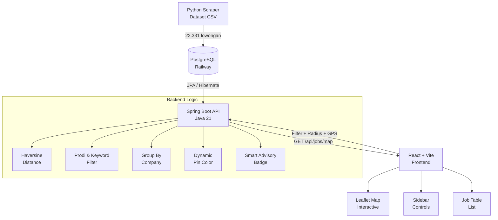
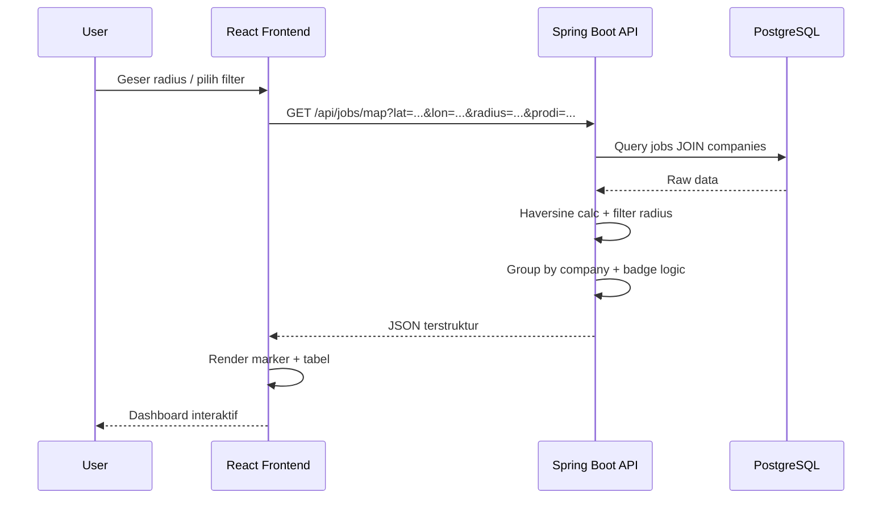

<div align="center">

# 🗺️ GeoJob Hunter

### Aplikasi Web Pencari Lowongan Kerja Berbasis Peta Interaktif

**Temukan lowongan magang & kerja dari 3.148+ perusahaan di 453 kota seluruh Indonesia!**

[](https://geo-job-hunter-maganghub-day1.vercel.app)
[](https://geojobhuntermaganghubday1-production.up.railway.app)
[](https://spring.io/projects/spring-boot)
[](https://react.dev)
[](https://railway.app)
[](https://maganghub.kemnaker.go.id)
[](LICENSE)

---

### 🚀 **Live Demo**

| Link | URL |
|------|-----|
| 🌐 **Frontend (Vercel)** | [https://geo-job-hunter-maganghub-day1.vercel.app](https://geo-job-hunter-maganghub-day1.vercel.app) |
| ⚙️ **Backend API (Railway)** | [https://geojobhuntermaganghubday1-production.up.railway.app](https://geojobhuntermaganghubday1-production.up.railway.app) |
| 📄 **API Docs** | `GET /api/jobs/locations` — daftar kota |

---

</div>

## 📊 Dataset

**22.331 lowongan magang** dari **3.148 perusahaan** di **453 kota/kabupaten** seluruh Indonesia — bersumber dari [MagangHub Kemnaker RI](https://maganghub.kemnaker.go.id).

| Wilayah | Contoh Kota |
|---------|-------------|
| **Sumatra** | Banda Aceh, Medan, Padang, Palembang, Lampung |
| **Jawa** | Jakarta, Bandung, Semarang, Yogyakarta, Surabaya |
| **Kalimantan** | Pontianak, Banjarmasin, Samarinda, Balikpapan |
| **Sulawesi** | Makassar, Manado, Palu, Kendari |
| **Bali & Nusa Tenggara** | Denpasar, Mataram, Kupang |
| **Maluku & Papua** | Ambon, Jayapura, Sorong |

---

## ✨ Fitur Utama

| Fitur | Teknologi |
|-------|-----------|
| 🗺️ **Peta Interaktif** | React-Leaflet + OpenStreetMap |
| 📍 **Radius Pencarian** | Slider 1–5.000 km, debounce 400ms |
| 🎯 **Filter Prodi & Keyword** | Backend query + frontend dropdown |
| 📡 **GPS Otomatis** | Browser Geolocation API |
| 🏷️ **Smart Badge** | AI-advisory: "Peluang Emas", "Standar", dll |
| 🚦 **Warna Pin Dinamis** | Hijau (banyak kuota), Orange, Merah (ketat) |
| 🗺️ **Rute Google Maps** | Tiap popup perusahaan ada tombol rute |
| 📱 **Responsive** | Tailwind CSS, mobile-friendly |
| 🌗 **Dark Mode** | — |

---

## 🏗️ Arsitektur Sistem





---

## 🛠️ Tech Stack

| Layer | Teknologi |
|-------|-----------|
| **Frontend** | React 18, Vite 5, Tailwind CSS 3, React-Leaflet 4, Axios |
| **Backend** | Java 21, Spring Boot 3.2.5, Spring Data JPA, Hibernate |
| **Database** | PostgreSQL 16 (Railway) |
| **Deployment** | Railway (backend), Vercel (frontend) |
| **Dataset** | 25.040 baris CSV dari MagangHub Kemnaker RI |

---

## 🚀 Quick Start

### Backend

```bash
cd backend
./mvnw spring-boot:run
# API akan berjalan di http://localhost:8080
```

### Frontend

```bash
cd frontend
npm install
npm run dev
# Aplikasi akan berjalan di http://localhost:5173
```

### Environment Variables

**Backend** (`application.yml`):
```yaml
spring:
  datasource:
    url: jdbc:postgresql://localhost:5432/geojob_hunter
    username: postgres
    password: ${DB_PASSWORD:postgres}
```

**Frontend** (`.env`):
```env
VITE_API_BASE_URL=http://localhost:8080
VITE_MAP_DEFAULT_LAT=-6.2000
VITE_MAP_DEFAULT_LON=106.8166
VITE_MAP_DEFAULT_ZOOM=12
```

---

## 📁 Struktur Project

```
GeoJobHunter/
├── backend/                          # Spring Boot API
│   ├── src/main/java/com/geojob/
│   │   ├── GeoJobApplication.java    # Entry point
│   │   ├── config/CorsConfig.java    # CORS configuration
│   │   ├── entity/                   # JPA Entities
│   │   │   ├── Company.java
│   │   │   └── Job.java
│   │   ├── repository/              # Spring Data JPA
│   │   ├── service/                 # Business logic
│   │   │   └── JobMapService.java   # Haversine + filter engine
│   │   ├── controller/              # REST endpoints
│   │   │   └── JobMapController.java
│   │   ├── dto/                     # Response DTOs
│   │   └── seeder/                  # CSV DataSeeder
│   └── src/main/resources/
│       ├── application.yml
│       └── lowongan.csv.gz          # 25k dataset (compressed)
├── frontend/                        # React + Vite
│   ├── src/
│   │   ├── App.jsx                  # Root component
│   │   ├── components/
│   │   │   ├── Sidebar.jsx          # Filter controls
│   │   │   ├── MetricsCards.jsx     # Stats cards
│   │   │   ├── JobMap.jsx           # Leaflet map
│   │   │   └── JobTable.jsx         # Job list table
│   │   ├── hooks/useJobMap.js      # State management
│   │   └── services/api.js         # Axios client
│   ├── vercel.json                  # Vercel proxy config
│   └── .env.example
└── scraper/                         # Python data tools
    ├── requirements.txt
    └── seed_data.py
```

---

## 📡 API Endpoints

### `GET /api/jobs/map`
Endpoint utama pencarian lowongan berbasis lokasi.

| Parameter | Tipe | Default | Deskripsi |
|-----------|------|---------|-----------|
| `lat_user` | float | — | Latitude pengguna |
| `lon_user` | float | — | Longitude pengguna |
| `radius` | float | 10 | Radius pencarian (km) |
| `prodi` | string | — | Filter program studi |
| `keyword` | string | — | Filter nama lowongan |
| `lokasi` | string | — | Filter kota/kabupaten |
| `sortBy` | string | `asc` | `asc` = terdekat, `desc` = terjauh |

**Response:**
```json
{
  "totalLowongan": 22331,
  "totalPerusahaan": 3148,
  "perusahaan": [
    {
      "companyId": 1,
      "namaPerusahaan": "PT Teknologi Nusantara",
      "lat": -6.1864,
      "lon": 106.8233,
      "totalKuota": 10,
      "warnaPin": "green",
      "jarakKm": 2.3,
      "lowongan": [
        {
          "id": 1,
          "namaLowongan": "Fullstack Developer",
          "prodiSyarat": "Informatika, Sistem Informasi",
          "kuota": 3,
          "linkLamar": "https://...",
          "badge": "🎯 Peluang Emas!",
          "tips": "Lowongan besar & syarat spesifik. Segera lamar!"
        }
      ]
    }
  ]
}
```

### `GET /api/jobs/locations`
Daftar semua kota/kabupaten unik untuk dropdown filter.

---

## 🧠 Algoritma Kunci

### Haversine Formula
Perhitungan jarak antara koordinat user dengan perusahaan dalam km:

```
a = sin²(Δlat/2) + cos(lat1)·cos(lat2)·sin²(Δlon/2)
c = 2 · atan2(√a, √(1-a))
jarak = 6371 · c
```

### Smart Advisory Badge
| Kriteria | Badge | Warna Pin |
|----------|-------|-----------|
| Kuota ≥ 5 ATAU prodi ≤ 2 | 🎯 Peluang Emas! | 🟢 Hijau |
| Kuota < 3 DAN prodi > 3 | 🔥 Persaingan Ketat | 🔴 Merah |
| Sisanya | ⚖️ Standar | 🟠 Orange |

---

## 🔗 Links

- **Frontend:** [https://geo-job-hunter-maganghub-day1.vercel.app](https://geo-job-hunter-maganghub-day1.vercel.app)
- **Backend API:** [https://geojobhuntermaganghubday1-production.up.railway.app](https://geojobhuntermaganghubday1-production.up.railway.app)
- **Repository:** [https://github.com/arityo182/GeoJobHunterMaganghubDay1](https://github.com/arityo182/GeoJobHunterMaganghubDay1)
- **Dataset:** [MagangHub Kemnaker RI](https://maganghub.kemnaker.go.id)

---

<div align="center">

Dibangun dengan ❤️ menggunakan Spring Boot + React + PostgreSQL

</div>
